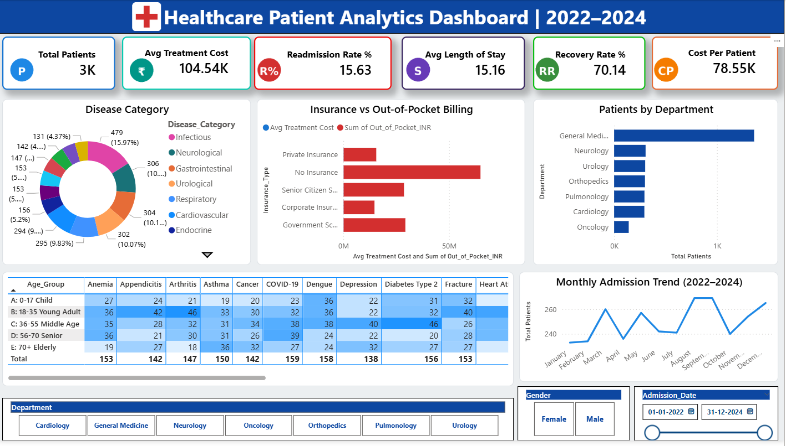

# Healthcare-Patient-Analytics-Dashboard
SQL + Power BI + DAX + Excel Healthcare Analytics Project with 3000 patient records
# 🏥 Healthcare Patient Analytics & Hospital Performance Dashboard

## 📌 Project Overview
Built a complete end-to-end healthcare analytics solution to help
hospital management make data-driven decisions using 3000 patient
records from 2022 to 2024.

## 🛠️ Tools & Technologies
| Tool            | Purpose |
|------           |---------|
| PostgreSQL      | Data extraction using Joins, CTEs, Window Functions |
| Power BI        | Interactive dashboard with 8+ visuals |
| DAX             | Custom KPI measures and calculated columns |
| Advanced Excel  | What-If Analysis and budget forecasting |
| ChatGPT         | Automated monthly report generation |

## 📊 Key KPIs Tracked
- ✅ Total Patient Admission Volume — 3,000 patients
- ✅ Readmission Rate % — 15.63%
- ✅ Average Treatment Cost — ₹1,04,540
- ✅ Average Length of Stay — 15.16 days
- ✅ Patient Recovery Rate — 70.14%
- ✅ Cost Per Patient — ₹78,550

## 📈 Dashboard Features
- Monthly Admission Trend Analysis (2022–2024)
- Disease Category Breakdown (10 categories)
- Department-wise Performance Scorecard
- Age Group vs Diagnosis Heatmap Matrix
- Insurance vs Out-of-Pocket Billing Analysis
- Interactive Slicers (Department, Gender, Date Range)

## 🗄️ SQL Highlights
- Used CTEs for clean patient summary extraction
- Window Functions for department ranking
- Joins across multiple hospital data tables
- Monthly trend aggregation queries

## 📉 Excel Analysis
- What-If Analysis for budget forecasting
- Scenarios: +10%, +20%, +30%, -10%, -20% patient volume
- Pivot Tables and Charts for department analysis

## 🤖 ChatGPT Automation
- Automated monthly KPI summary reports
- Reduced reporting time by 70%
- Prompt engineering for consistent output format

## 📁 Files in This Repository
| File                              | Description |
|------                             |-------------|
| Healthcare_Raw_Data_3000rows.xlsx | Raw dataset with 3000 patient records |
| hospital_queries.sql              | All PostgreSQL queries used |
| Healthcare_Dashboard_Final.png    | Dashboard screenshot |
| Healthcare_Dashboard.pbix         | Power BI dashboard file |
| chatgpt_prompts.txt               | ChatGPT prompts for automation |

## 💡 Key Insights Found
1. General Medicine had highest patient volume (1K+ patients)
2. No Insurance patients paid 3x more out-of-pocket
3. 18-35 age group had highest Appendicitis cases
4. Infectious diseases accounted for 15.97% of all casess

## 👤 Author
**Danish Siddiqui**
Data Analyst | SQL • Power BI • Excel • Python
